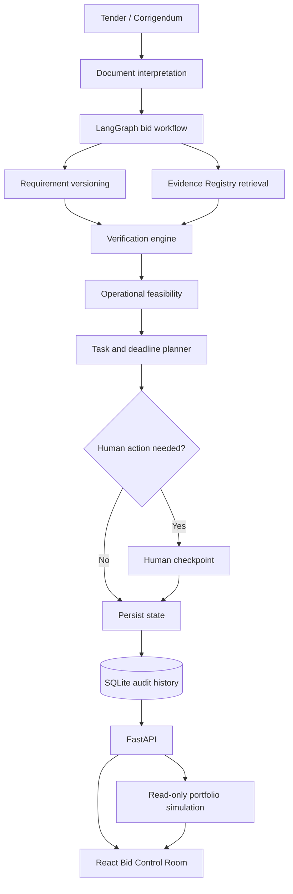

# GeBIZ BidOps

> Know the moment your bid stops being safe.

GeBIZ BidOps is a supplier-side bid control layer for Singapore SMEs. It turns tender obligations, company evidence, assessments, tasks, and tender changes into one persistent operational state. It does not replace GeBIZ, submit a bid, or make a commercial bid/no-bid decision.

This hackathon MVP is optimised for one clear story: a tender was feasible yesterday; a
corrigendum changes one mandatory manpower requirement; the old pass becomes stale; and the same
change creates a capacity collision with another opportunity. BidOps shows the bid-level recovery
and the portfolio-level trade-off without falsely restoring either one to green.

## Product

The hard part of tendering starts after opportunity discovery. Small bid teams must continually answer:

- Which mandatory obligations are verified?
- What evidence supports each conclusion, and is it still valid?
- What changed after an amendment?
- Which earlier assessments are now unsafe?
- Can a newly discovered gap still be recovered before closing?

BidOps models this as:

```text
Requirement → Evidence → Assessment → Change → Impact → Recovery Action
```

The optional portfolio simulation continues the trace:

```text
Validated clause change → Dated capability-demand delta → Cross-tender collision
→ { Deterministic counterfactual options + Capability roadmap } → Human decision
```

Operational feasibility uses four explicit states: `FEASIBLE`, `RECOVERABLE`, `BLOCKED`, and `UNCERTAIN`. Submission Coverage is tracked independently and never overrides a broken mandatory gate.

The exact bid-state formulas, precedence, thresholds, and API trace fields are documented in
[Deterministic calculation rules](docs/CALCULATION_RULES.md). The separate, caller-supplied and
non-persisting portfolio calculation is documented in
[Portfolio capability simulation](docs/PORTFOLIO_SIMULATION.md). The current runtime AI boundary is
documented in [Current AI boundary](docs/AI_BOUNDARY.md).

## Why this is more than a chatbot

BidOps does not answer a prompt and stop. A corrigendum moves through a stateful workflow that
updates the bid record, rechecks evidence, and leaves the final decision with the team:

```text
Persistent bid state
+ change event
+ semantic impact interpretation
+ evidence retrieval
+ deterministic re-verification
+ dependency-aware replanning
+ human checkpoint
```

After that persisted LangGraph workflow completes, the bid read model can attach a separate,
non-persisting portfolio simulation from supplied capability counts and service windows. Route
selection stays in the UI and does not mutate the workflow or database.

LangGraph coordinates the bid-change steps. Bedrock handles the language comparison; ordinary code
handles numeric thresholds, certification validity, version history, critical gates, task
dependencies, coverage, deadline slack, overlapping service windows, peak capability demand, and
counterfactual route outcomes. People decide which pursuit to protect. The main synthetic
fixture also has a built-in interpretation, so the demo remains reliable without cloud credentials
while still creating the same persisted state changes.

## Architecture



### Project layout

```text
backend/app/
  demo/          synthetic company, tender, evidence, and assessments
  graph/         typed LangGraph state and corrigendum workflow
  llm/           Bedrock prompts, Pydantic outputs, validation, and demo fallback
  portfolio/     deterministic capability-demand simulation and demo scenario
  rules/         typed reusable procurement rules and deterministic evaluators
  services/      assessment, feasibility, coverage, and deadline rules
  database.py    SQLite engine and session lifecycle
  models.py      SQLAlchemy domain entities
  main.py        FastAPI endpoints
  serializers.py bid control-room read model

frontend/src/
  api/           typed API client
  components/    metrics, requirement control, detail, activity drawer
  types/         shared frontend contract
  App.tsx        Bid Control Room workflow
```

## Setup

Prerequisites: Node.js 20+ and [`uv`](https://docs.astral.sh/uv/). `uv` will provision a compatible Python runtime when needed.

### One-command local start

From PowerShell:

```powershell
cd C:\GeBIZ
powershell -ExecutionPolicy Bypass -File .\scripts\start.ps1
```

This creates `.env` when absent, installs locked Python and Node dependencies, starts FastAPI and
Vite in the background, waits for both health checks, and writes logs under `data/logs/`. Open
`http://127.0.0.1:5173`.

For later starts without reinstalling dependencies:

```powershell
.\scripts\start.ps1 -SkipInstall
```

Stop only the processes recorded by the startup script:

```powershell
.\scripts\stop.ps1
```

### Backend

```powershell
cd C:\GeBIZ
uv sync
uv run uvicorn app.main:app --app-dir backend --reload
```

The API runs at `http://127.0.0.1:8000`; interactive API documentation is at `/docs`. SQLite is created at `data/bidops.db`.

### Frontend

```powershell
cd C:\GeBIZ\frontend
npm install
npm run dev
```

Open `http://127.0.0.1:5173`. Vite proxies `/api` to FastAPI.

`DEMO_MODE=true` keeps the synthetic scenario and demo clock deterministic. The hackathon region
is fixed to `AWS_DEFAULT_REGION=us-east-1`. AWS secret fields are intentionally blank: once the
lease is active, either set `AWS_PROFILE`, or place the temporary `AWS_ACCESS_KEY_ID`,
`AWS_SECRET_ACCESS_KEY`, and `AWS_SESSION_TOKEN` in the ignored local `.env`; then set an accessible
`BEDROCK_MODEL_ID` and leave `LLM_PROVIDER=bedrock`. Temporary lease credentials expire roughly
every 12 hours. No code change is required.

After lease approval and after placing temporary credentials plus an explicit cheap on-demand
model ID in `.env`, run the guarded AWS validation:

```powershell
cd C:\GeBIZ
powershell -ExecutionPolicy Bypass -File .\scripts\validate-aws-post-approval.ps1
```

It verifies STS and `us-east-1`, lists only discovered Nova Micro/Lite or Claude Haiku on-demand
candidates, rejects provisioned model identifiers, runs a minimal validated interpretation, proves
the live Bedrock-to-R17-to-`RECOVERABLE` path, and runs the known live-model regression. If the
temporary credentials have expired, refresh them locally and rerun; the script never prints them.

Use `BEDROCK_STRUCTURED_OUTPUT=true` only with a model that actually supports Bedrock's native
`outputConfig` JSON Schema feature. For compatible on-demand models such as the sandbox's Nova Lite
v1, `BEDROCK_STRUCTURED_OUTPUT=false` supplies the schema in the untrusted-data-safe prompt and
still requires strict local Pydantic and exact-provenance validation. Reports distinguish these
modes; prompted JSON must not be described as Bedrock-native constrained decoding.

For temporary Groq validation, set `LLM_PROVIDER=groq`, `GROQ_API_KEY`, and either
`GROQ_MODEL_ID` or its supported alias `GROQ_MODEL`. Model IDs are never guessed. With no valid
selected-provider configuration, or when a provider call fails, the built-in demo interpretation
is used. The UI displays Bedrock or Groq only after that provider actually produced and persisted
the interpretation; otherwise it displays Demo fallback.

## Demo

1. Open the Bid Control Room. Confirm `FEASIBLE`, `8 / 8` Critical Gates, `91%` Submission Coverage, and `LOW` Deadline Risk.
2. Select R17. Show three verified CISSP personnel sets and source traceability to Technical Specification page 17, section 4.3.
3. Click **Apply Corrigendum #2**. This calls the FastAPI endpoint and runs the LangGraph workflow.
4. Show R17 v2: the minimum changes from three to four, while the v1 assessment remains visible as `SUPERSEDED`.
5. Show the state transition to `RECOVERABLE` and `7 / 8` Critical Gates.
6. Show Engineer D: CISSP is verified, CV is stale, and availability is unknown. The requirement correctly remains `PARTIAL`.
7. Show the four recovery tasks, their dependencies, the verification deadline, and the impact chain.
8. In **Latest Change**, open **Compare 3 routes**. Keep the two scopes separate: the current bid is
   `RECOVERABLE`, while the synthetic continue-all portfolio is `BLOCKED` because overlapping demand
   is five capability slots against four identified potential slots.
9. Compare the three deterministic counterfactuals: protect this tender, protect the companion
   commitment, or verify additional capacity. These are consequences under stated assumptions, not
   recommendations or automatic actions.
10. Show **Capability next steps** and **Assumptions and calculation**. The companion opportunity,
    both service windows, the no-double-booking rule, and the capacity counts are synthetic demo
    assumptions.
11. Open **Audit trail** to show the recorded bid-level events from document parsing through status
    recomputation.
12. Point out the locked human checkpoint. BidOps never reallocates staff, withdraws a bid, engages a
    partner, or submits to GeBIZ.
13. Click the reset icon to replay the demonstration.

### Demo reset

The header reset control returns the application to the baseline `FEASIBLE / 8 of 8 / 91% /
LOW` state. The equivalent copy-paste command is:

```powershell
Invoke-RestMethod -Method Post http://127.0.0.1:8000/api/demo/reset
```

## API

The primary demo endpoints are:

```text
GET  /api/bids/BID-DEMO-001
POST /api/tenders/interpret-requirements
POST /api/corrigenda/interpret-change
POST /api/portfolio/simulate
POST /api/demo/reset
POST /api/demo/bids/BID-DEMO-001/apply-corrigendum
POST /api/tasks/{task_id}/complete
POST /api/evidence/{evidence_id}/verify
POST /api/bids/BID-DEMO-001/human-approve
```

The two interpretation endpoints return validated structured objects without mutating bid state.
The portfolio endpoint runs a deterministic, non-persisting simulation over caller-supplied
capability pools, opportunity demands, and dated service windows. Applying the same corrigendum
twice returns `409 Conflict`; unmatched, ambiguous, or unsafe changes return useful `422` errors
before an assessment is superseded.

## Testing

```powershell
cd C:\GeBIZ
powershell -ExecutionPolicy Bypass -File .\scripts\check.ps1
```

This runs Ruff, all backend tests, frontend tests, the TypeScript/Vite production build, and the
deterministic external benchmark. Add `-RunLiveEvaluation` only after configuring an authorized
live provider.

Run only the GeBIZ-derived deterministic regression benchmark:

```powershell
cd C:\GeBIZ\backend
..\.venv\Scripts\python.exe -m evaluation.rule_runner --output ..\data\evaluation\deterministic_report.json
```

To add a deterministic regression case, place one schema-valid JSON object (or array) in
`backend/evaluation/rule_cases/`, then run the command above. The loader discovers JSON files
without production-code changes. Keep expected answers only in the benchmark record; they are not
sent to an LLM. The existing nine cases are known regression cases.

For genuinely unseen live interpretation, have a teammate freeze case JSON under
`backend/evaluation/cases/blind/`, then run:

```powershell
cd C:\GeBIZ
powershell -ExecutionPolicy Bypass -File .\scripts\run-blind-evaluation.ps1
```

The blind report separates requirement interpretation, corrigendum matching, ambiguity handling,
and final operational-state accuracy, and flags unsafe-green errors where a ground-truth
`BLOCKED`/`UNCERTAIN` case became `FEASIBLE`. Expected answers and deterministic facts are never
included in model inputs. Copy
`backend/evaluation/cases/blind/CASE_TEMPLATE.json.example` to a `.json` filename to add a case;
one facts object supports a single rule and an array supports multi-obligation passages. The
repository currently contains eight teammate-supplied cases that were frozen before their first
successful model run. Nova Lite scored 2/8 exact requirement interpretations, 7/8 ambiguity
decisions, and 4/8 final operational states, with zero unsafe-green errors. These results are
retained without tuning production prompts against the answer key.

That eight-case folder is now the observed **blind v1** set. It is retained as historical first-run
evidence and is not used for prompt or model selection. For the next genuinely unseen evaluation,
a teammate must place sealed cases under `backend/evaluation/cases/blind_v2/` and run:

```powershell
cd C:\GeBIZ
powershell -ExecutionPolicy Bypass -File .\scripts\run-blind-v2-evaluation.ps1
```

The blind-v2 command refuses to run while the folder has no `.json` cases. The repository does not
manufacture unseen ground truth or a performance claim.

The backend suite covers Bedrock- and Groq-shaped provider boundaries, exact source validation,
prompt-injection defenses, ambiguity, equivalent paraphrases, removal, deadline-only isolation,
malformed output retry/failure, the natural-language R17 transition, immutable version history,
evidence gaps, recovery dependencies, deterministic coverage, duplicate amendments, and explicit
`BLOCKED` and `UNCERTAIN` branches. Separate portfolio tests cover overlap and adjacent windows,
peak-demand arithmetic, hard shortfall, missing mandatory counts, unsupported capabilities,
non-persistence, and preservation of the bid-level hero state. Frontend tests verify the hero
state, truthful provider label, portfolio boundary labels, and backend-unavailable failure state.

Authorized external benchmark cases can be added as normalized JSON without changing Python test code. See [the benchmark harness guide](backend/tests/benchmarks/README.md).

Live interpretation evaluation is separate from those deterministic benchmarks. Known
GeBIZ-derived cases live under `backend/evaluation/cases/regression/`; development fixtures live
under `backend/evaluation/cases/development/`; genuinely unseen teammate cases belong only under
`backend/evaluation/cases/blind_v2/`. The live runner disables fallback and writes a
failure-classified JSON report with exact field differences, rule/fact bindings, attempts,
latency, and token usage. See [the interpretation evaluation guide](backend/evaluation/README.md).

To compare cheap Bedrock models without touching blind cases, run the fixed-prompt known-regression
bake-off:

```powershell
powershell -ExecutionPolicy Bypass -File .\scripts\run-bedrock-model-bakeoff.ps1
```

The current comparison retained `amazon.nova-lite-v1:0`: it outperformed Nova Micro v1 and the
Nova 2 Lite system inference profile on the same nine known regression cases.

Competition material: [Judge Q&A](docs/JUDGE_QA.md), [Demo runbook](docs/DEMO_RUNBOOK.md),
[Portfolio simulation](docs/PORTFOLIO_SIMULATION.md), [Demo video script](docs/DEMO_VIDEO_SCRIPT.md),
and [Pitch assets](docs/PITCH_ASSETS.md).

## Synthetic data

All company, employee, tender, evidence, project, and corrigendum data is fictional. NexusFort
Technologies Pte. Ltd., Demo Government Agency, document references, certification identifiers,
and project records exist only for this demonstration. The tender language is original synthetic
text. The companion opportunity, service windows, capacity pool, and no-double-booking assumption
used by the portfolio demonstration are also synthetic; they are not GeBIZ or employer records.

## Safety and human control

BidOps supports internal preparation and operational verification. It does not claim legal
certainty, sign declarations, make commercial decisions, fabricate GeBIZ integrations, reassign
people, contact partners, withdraw bids, or submit tenders. Final tender interpretation, staffing,
commercial decisions, and submission remain the supplier's responsibility.

## Known limitations

- The supplied documents, company, evidence, and corrigendum are synthetic demo data; there is no
  GeBIZ connection or automatic submission path.
- The HTTP interpretation boundary accepts extracted page/section text. PDF upload and OCR are not
  part of this frozen MVP.
- The portfolio layer operates on supplied capability counts and dated demand windows. It is not a
  named-person scheduler, and it does not infer staff assignments from calendars or HR systems.
- Portfolio routes are deterministic counterfactuals, not recommendations. No pricing, margin,
  award probability, market forecast, or automatic execution is implemented.
- Capability-roadmap items aggregate only known gaps in the supplied opportunities. They indicate
  which eligibility checks could be addressed; they do not predict wins, revenue, or startup growth.
- Live Bedrock validation uses `amazon.nova-lite-v1:0` in `us-east-1`. The R17 demo change
  passed. The final known-regression run scored 6/7 exact requirement interpretations, 2/2
  corrigendum matches, 9/9 ambiguity decisions, and 8/9 final operational states. The frozen
  eight-case blind-v1 set scored 2/8, not applicable, 7/8, and 4/8 respectively, with zero
  unsafe-green errors on its historical first run; it was not rerun or used for this round's
  selection. Native JSON-schema output with Claude Haiku 4.5 remains unavailable because
  the sandbox role lacks
  `aws-marketplace:ViewSubscriptions` and `aws-marketplace:Subscribe`; Nova Lite uses prompted JSON
  plus strict local validation.
- The nine structured GeBIZ-derived cases are a deterministic regression set that informed
  development, not an unseen-AI accuracy claim.
- SQLite is appropriate for the local single-user demonstration, not a multi-user production
  deployment.
