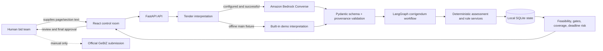
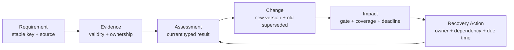

# Pitch assets

## One-line problem

Tender teams lose control when mandatory obligations, evidence, deadlines, and corrigenda are
spread across documents and spreadsheets, so an apparently ready bid can become unsafe overnight.

## One-line product thesis

GeBIZ BidOps turns tender language into source-linked obligations and propagates every validated
change through evidence, feasibility, and recovery—while deterministic rules and humans retain
control of the bid decision.

## Architecture



The frozen MVP keeps React, FastAPI, LangGraph, and SQLite local. AWS is used only for optional
Bedrock inference after sandbox approval; there is no always-on cloud infrastructure.

## Corrigendum sequence

```mermaid
sequenceDiagram
    actor User as Bid manager
    participant UI as React UI
    participant API as FastAPI
    participant LLM as Bedrock or demo fallback
    participant V as Pydantic/provenance guard
    participant W as Deterministic workflow
    participant DB as SQLite

    User->>UI: Apply Corrigendum #2
    UI->>API: POST corrigendum
    API->>LLM: Existing R17 + new source text
    LLM-->>V: MODIFIED, R17, minimum_count 3→4
    V->>V: Validate schema and exact source snippet
    V-->>W: Accepted structured change
    W->>DB: Store R17 v2; retain v1
    W->>DB: Mark v1 assessment SUPERSEDED
    W->>W: Re-evaluate evidence and recoverability
    W->>DB: Persist PARTIAL, tasks, metrics, activity
    DB-->>API: RECOVERABLE, 7/8, 84%, MEDIUM
    API-->>UI: Render traceable backend state
    UI-->>User: Review recovery and human checkpoint
```

## Core control flow



Invariant: **Requirement → Evidence → Assessment → Change → Impact → Recovery Action**.

## Responsibility boundaries

| Responsibility | LLM | Deterministic code | Human |
|---|---:|---:|---:|
| Interpret supplied tender prose into typed requirements | Primary, when live provider succeeds | Schema/provenance validation and safe fallback | Confirm source completeness and review |
| Match a corrigendum to a stable requirement and list field changes | Primary, when live provider succeeds | Reject malformed, ambiguous, unsafe, or out-of-scope output | Resolve unclear amendments |
| Version requirements and supersede old assessments | No | Yes | Review history |
| Match evidence and evaluate mandatory gates | No | Yes | Supply/verify authoritative evidence |
| Decide `FEASIBLE`, `RECOVERABLE`, `BLOCKED`, `UNCERTAIN` | No | Yes | Challenge/approve internal conclusion |
| Compute Critical Gates, Submission Coverage, Deadline Risk | No | Yes | Act on drivers |
| Create recovery tasks and dependencies | No | Yes | Own and complete tasks |
| Commercial decision, declarations, final approval, submission | No | No automatic action | Sole control |

## Regression benchmark summary

The **GeBIZ-derived deterministic regression benchmark** contains nine cases spanning event
attendance, qualification, required documents, processing windows, participation restrictions,
and source freshness.

| Measure | Current frozen result |
|---|---:|
| Deterministic requirement-result accuracy | 9/9 (100%) |
| Deterministic overall bid-status accuracy | 9/9 (100%) |
| Unsupported cases | 0 |
| Live requirement interpretation | 6/7 known regression; 2/8 historical frozen blind-v1 run |
| Live corrigendum matching | 2/2 on known regression cases |
| Live ambiguity handling | 9/9 known regression; 7/8 historical frozen blind-v1 run |
| Live final operational state | 8/9 known regression; 4/8 historical frozen blind-v1 run |
| Live R17 transition | PASS with `amazon.nova-lite-v1:0` |
| Unsafe-green errors | 0 in known regression and historical frozen blind-v1 run |

These nine cases informed development. The 100% result is a regression claim about deterministic
rules, not unseen model accuracy.

## Current limitations

- Live Bedrock results are mixed: Nova Lite passed the R17 path and both known corrigendum cases,
  while exact requirement interpretation reached 6/7 on known regression and 2/8 on the historical
  frozen blind-v1 run. The blind-v1 set was not rerun after this round's known-regression-driven
  changes; blind-v2 intake is ready but intentionally empty. Native structured output with Claude
  Haiku 4.5 is unavailable because the sandbox
  role lacks required Marketplace subscription actions.
- The demo data and documents are synthetic.
- The product accepts extracted page/section text; PDF upload, OCR, and live GeBIZ retrieval are
  not implemented.
- No model or system can guarantee extraction completeness; human review and blind evaluation are
  still required.
- SQLite/local single-user execution is suitable for the hackathon, not production multi-user use.
- There is no authentication, automatic proposal writing, pricing optimization, competitor
  intelligence, or GeBIZ submission.

## 30-second pitch

“A bid can look ready in the morning and become unsafe when a corrigendum lands that afternoon.
GeBIZ BidOps links each requirement to its evidence, keeps earlier decisions as versioned history,
and shows the team exactly what must be recovered before closing. Bedrock reads the change;
ordinary rules decide the bid state; people keep the final say. In our demo, one sentence raises
the manpower minimum from three to four and the bid moves from FEASIBLE to RECOVERABLE.”

## 60-second pitch

“Singapore suppliers do not only need to find tenders—they need to keep a changing bid safe to
submit. Today, mandatory clauses, staff qualifications, evidence, tasks, and corrigenda live in
separate documents and spreadsheets. A high completion percentage can hide one fatal gate.

GeBIZ BidOps gives the team one working record: Requirement, Evidence, Assessment, Change, Impact,
and Recovery Action. Bedrock has one narrow job—turn tender wording into validated structured
changes with a document, page, section, and exact snippet. From there, ordinary code versions the
requirement, retires stale assessments, rechecks evidence, applies the four-state feasibility
policy, and calculates coverage and deadline risk.

When Corrigendum #2 raises R17 from three to four CISSP engineers, BidOps retains v1, creates v2,
finds that Engineer D's CV and availability are incomplete, and moves FEASIBLE to RECOVERABLE with
four dependency-aware actions. It also demonstrates BLOCKED and UNCERTAIN outcomes, so it does not
always say yes. Final approval and GeBIZ submission remain human decisions.”

## Business value

BidOps reduces amendment-response time, prevents stale passes from surviving a source change, and
focuses scarce bid-team effort on the one obligation or task that controls submission viability.
For an SME, that means fewer avoidable disqualifications, clearer ownership, faster recovery, and a
more defensible internal go/no-go decision—without automating irreversible submission.
